# Netflix dbt Project - Visual Flowchart

## Complete Data Pipeline Flow


## dbt Execution Flow

```mermaid
sequenceDiagram
    participant Dev as Developer
    participant DBT as dbt CLI
    participant SF as Snowflake
    participant Docs as Documentation

    Dev->>DBT: dbt debug
    DBT->>SF: Test connection
    SF-->>DBT: Connection OK
    DBT-->>Dev: ✓ All checks passed

    Dev->>DBT: dbt deps
    DBT->>DBT: Install dbt_utils
    DBT-->>Dev: ✓ Packages installed

    Dev->>DBT: dbt seed
    DBT->>SF: CREATE TABLE seed_movie_release_dates
    DBT->>SF: INSERT 10 rows
    SF-->>DBT: Success
    DBT-->>Dev: ✓ Seed loaded

    Dev->>DBT: dbt run
    
    DBT->>SF: CREATE VIEW src_movies
    DBT->>SF: CREATE VIEW src_tags
    DBT->>SF: CREATE VIEW src_ratings...
    SF-->>DBT: Staging views created

    DBT->>SF: CREATE TABLE dim_movies
    DBT->>SF: CREATE TABLE dim_users
    DBT->>SF: CREATE TABLE dim_genome_tags
    SF-->>DBT: Dimension tables created

    DBT->>SF: CREATE TABLE fct_ratings (incremental)
    DBT->>SF: CREATE TABLE fct_genome_score
    SF-->>DBT: Fact tables created

    DBT->>SF: CREATE VIEW genre_ratings
    DBT->>SF: CREATE VIEW user_engagement
    DBT->>SF: CREATE VIEW tag_relevance...
    SF-->>DBT: Gold views created

    DBT->>SF: CREATE TABLE mart_movie_realeases
    SF-->>DBT: Mart table created

    DBT-->>Dev: ✓ 20 models built successfully

    Dev->>DBT: dbt test
    DBT->>SF: SELECT (test queries)
    SF-->>DBT: Test results
    DBT-->>Dev: ✓ 15 tests passed

    Dev->>DBT: dbt snapshot
    DBT->>SF: CREATE/UPDATE snap_tags (SCD Type 2)
    SF-->>DBT: Snapshot updated
    DBT-->>Dev: ✓ Snapshot complete

    Dev->>DBT: dbt docs generate
    DBT->>Docs: Generate manifest.json
    DBT->>Docs: Generate catalog.json
    DBT-->>Dev: ✓ Documentation generated

    Dev->>DBT: dbt docs serve
    DBT->>Docs: Start web server on :8080
    Docs-->>Dev: 📊 http://localhost:8080
```



## Model Dependency Graph (DAG)


## Data Transformation Process


## Incremental Loading Strategy


## Testing Framework Flow


---

## Quick Reference Commands

```bash
# Setup
dbt debug              # Test connection
dbt deps               # Install packages

# Build
dbt seed               # Load seed files
dbt run                # Build all models
dbt run --select model # Build specific model

# Test
dbt test               # Run all tests
dbt test --select model # Test specific model

# Incremental
dbt run --full-refresh # Force full rebuild

# Documentation
dbt docs generate      # Generate docs
dbt docs serve         # View docs (localhost:8080)

# Snapshots
dbt snapshot           # Run SCD Type 2 tracking
```
